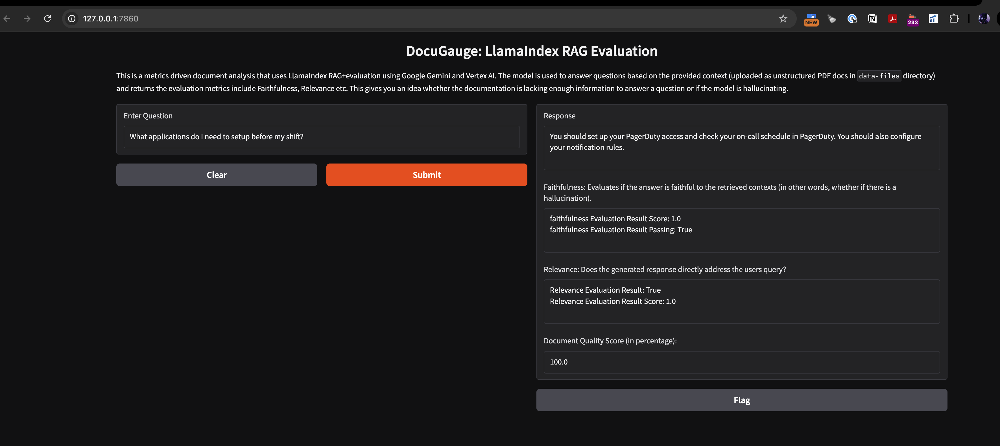

# DocuGauge: A document quality evaluator using LlamaIndex RAG using VertexAI+Gemini
This POC creates a in-mem Vector DB to ingest and load documents provided to it and uses Similarity based
retrievers to answer questions posed to the LLM about this document. 
Each answer is then run against a Evaluation LLM that measures the response against the query and the context of the 
retrieved contents to help identify if the document has missed content.
## How to run
- Add you docs/pdfs in `data-files` directory
- Add creds to `.env`
- Run `uv run main.py`

## Metrics Measured:
- [Faithfulness](https://docs.ragas.io/en/stable/concepts/metrics/available_metrics/faithfulness/) - The Faithfulness metric measures how factually consistent a response is with the retrieved context. It ranges from 0 to 1, with higher scores indicating better consistency.
- [Answer Relevancy](https://docs.ragas.io/en/stable/concepts/metrics/available_metrics/answer_relevance/) - measures how relevant a response is to the user input. Higher scores indicate better alignment with the user input, while lower scores are given if the response is incomplete or includes redundant information.

## UI screenshot

## Todo
- build a FAQ generator
- Add persistence layer to the in-mem vector DB
